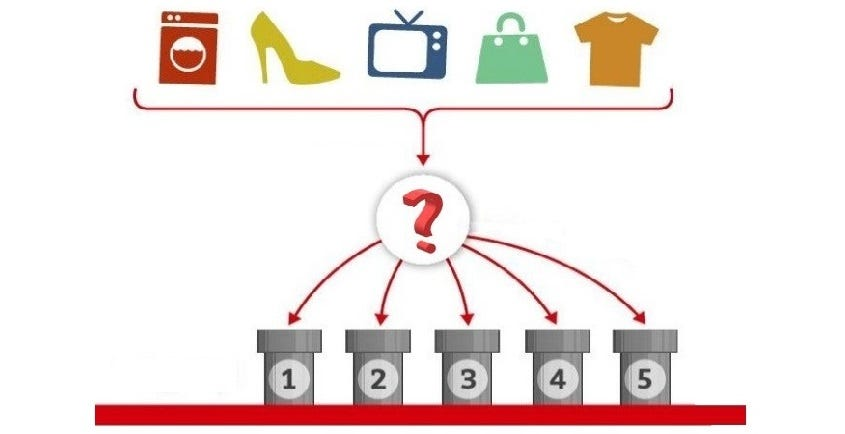

## Mohamed Ashraf Khalifa - Data Scientist & Machine Learning Engineer

### Introduction
Greetings! I'm Mohamed Ashraf Khalifa, a diligent professional with expertise in data science, analytics, and machine learning engineering. Armed with a solid educational background in Computer Science and Artificial Intelligence from Helwan University, I offer a blend of theoretical knowledge and practical skills to drive success in data-driven projects.

### Skills
- **Machine Learning**: Proficient in developing and deploying ML models for classification, regression, and clustering tasks.
- **Deep Learning**: Skilled in utilizing deep learning techniques, with expertise in TensorFlow and PyTorch.
- **Data Visualization**: Experienced in crafting insightful visualizations using tools like Tableau, Power BI, and Excel.
- **Data Analysis**: Proficient in advanced statistical methods and exploratory data analysis for deriving actionable insights.
- **Programming**: Fluent in Python, proficient in libraries like NumPy, Pandas, Scikit-learn, Matplotlib, and Seaborn.
- **Database Management**: Well-versed in SQL for data retrieval, manipulation, and management.
- **Version Control**: Experienced in Git for collaborative development and project management.

### Projects
Here are some notable projects I've worked on:

1. **Slash Product Image Classifier**
   - Developed an efficient image classification system for product categorization.
   - Implemented various ML algorithms and rigorously assessed model performance.
   - 
   - [Repository Link](https://github.com/MohamedKhalifa1/Slash_Product_Image_Classifier)

2. **Emotion Detection**
   - Engineered a deep learning model for accurate emotion detection in images and videos.
   - Leveraged CNNs and transfer learning techniques for superior emotion recognition.
   - 
   - [Repository Link](https://github.com/MohamedKhalifa1/Emotion_Detection)

3. **Sentiment Analysis**
   - Conducted sentiment analysis on restaurant reviews to discern positive and negative sentiments effectively.
   - Utilized NLP techniques for text preprocessing and feature extraction.
   - 
   - [Repository Link](https://github.com/MohamedKhalifa1/Resturant_Review_Sentiment_Analysis)

### Education
- Bachelor's Degree in Computer Science and Artificial Intelligence, Helwan University.

### Contact
For professional inquiries or collaboration opportunities, feel free to connect with me:
- [LinkedIn](https://www.linkedin.com/in/mohamed-ashraf-696873213/)
- Email: m.ashraf.20162002@gmail.com

I'm enthusiastic about exploring potential collaborations and contributing to impactful projects in the realm of data science and machine learning!
